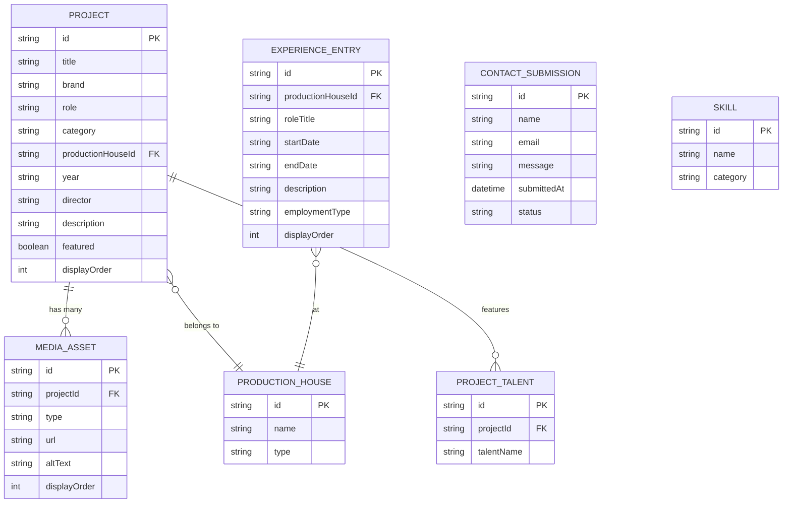

# Database Design Document (DDD)
## Donayan Sahdev — Director's Assistant / Creative Producer Portfolio Website

| | |
|---|---|
| **Document Owner** | Engineering / Technical Lead |
| **Companion Documents** | Donayan_Sahdev_Portfolio_Website_PRD.md (v1.0), Donayan_Sahdev_Portfolio_Website_TRD.md (v1.0) |
| **Version** | 1.0 |
| **Status** | Draft — Ready for Build |
| **Date** | July 2026 |

---

## 1. Purpose

This document defines the data storage structure supporting the portfolio website: entities, fields, types, relationships, constraints, and indexing. It is implementation-agnostic — the same schema applies whether the content source is a headless CMS's structured collections or flat structured data files (per TRD Section 4/15). No query code or DDL is included; this is a structural specification only.

---

## 2. Entity-Relationship Overview

---

## 3. Table Definitions

### 3.1 `Project`

Core entity representing a single work credit (e.g., "Armani Exchange w/ Kartik Aaryan SS'25").

| Field | Type | Constraints | Description |
|---|---|---|---|
| id | string | Primary Key, required | Unique identifier |
| title | string | required | Display name of the project (e.g., "Armani Exchange SS'25") |
| brand | string | required | Client/brand name (e.g., Armani Exchange, Sprite, Tanishq) |
| role | string (enum) | required | Normalized role — see Section 5.1 |
| category | string (enum) | required | Filter grouping — see Section 5.2 |
| productionHouseId | string | Foreign Key → ProductionHouse.id, required | Where the project was executed from |
| year | string | required | Year or season (e.g., "2025," "SS'25," "FW'24") |
| director | string | optional | Director name, if applicable and known |
| description | text | optional | Short project summary for detail view |
| featured | boolean | required, default: false | Controls homepage highlight carousel (PRD FR1) |
| displayOrder | integer | optional | Manual override for sort order within filtered views |

**Notes:** `talentInvolved` is intentionally modeled as a separate related table (`ProjectTalent`, Section 3.4) rather than a single text field, since several projects feature more than one named individual and filtering/search by talent may be valuable in Phase 2.

---

### 3.2 `MediaAsset`

Stores images/video references attached to a project.

| Field | Type | Constraints | Description |
|---|---|---|---|
| id | string | Primary Key, required | Unique identifier |
| projectId | string | Foreign Key → Project.id, required | Parent project |
| type | string (enum) | required | `image`, `video-embed`, `video-thumbnail` |
| url | string | required | Asset location (CDN-hosted) |
| altText | string | required | Accessibility description (NFR3) |
| displayOrder | integer | optional | Order of appearance if multiple assets per project |

**Notes:** Many `Project` rows in the current source material (work profile PDF) have no associated media yet. `MediaAsset` rows are optional per project — a project with zero media rows must still render gracefully (TRD Section 3, progressive enhancement principle).

---

### 3.3 `ProductionHouse`

Normalizes the employer/context under which a project or experience entry occurred, avoiding free-text duplication (e.g., "Twism Design" vs. "Twism Design Productions").

| Field | Type | Constraints | Description |
|---|---|---|---|
| id | string | Primary Key, required | Unique identifier |
| name | string | required, unique | e.g., Pink Flower, Twism Design, The Glitch (VMLY&R–WPP), Totality Solutions, Freelance |
| type | string (enum) | required | `In-House`, `Freelance`, `Internship` |

---

### 3.4 `ProjectTalent`

Join table capturing named talent/collaborators associated with a project (e.g., Kareena Kapoor, Kartik Aaryan, Nayanthara).

| Field | Type | Constraints | Description |
|---|---|---|---|
| id | string | Primary Key, required | Unique identifier |
| projectId | string | Foreign Key → Project.id, required | Related project |
| talentName | string | required | Name of actor/talent/notable collaborator featured |

**Notes:** This table intentionally stores names as plain text rather than linking to a full "Person" entity — building out individual talent profile pages is out of scope (see PRD Section 15, MVP Out of Scope).

---

### 3.5 `ExperienceEntry`

Represents a chronological career entry (distinct from individual project credits) — used to render the Experience Timeline (PRD FR5).

| Field | Type | Constraints | Description |
|---|---|---|---|
| id | string | Primary Key, required | Unique identifier |
| productionHouseId | string | Foreign Key → ProductionHouse.id, required | Employer for this entry |
| roleTitle | string | required | Normalized title (e.g., "Digital Media & Creative Head") |
| startDate | string | required | Stored as YYYY-MM for consistent sorting |
| endDate | string | optional | Null/blank if role is current (e.g., Pink Flower, ongoing) |
| description | text | optional | Summary of responsibilities/impact |
| employmentType | string (enum) | required | `In-House`, `Freelance`, `Internship` |
| displayOrder | integer | optional | Manual override if two entries share a start date |

---

### 3.6 `Skill`

Backs the categorized skills section (PRD FR10).

| Field | Type | Constraints | Description |
|---|---|---|---|
| id | string | Primary Key, required | Unique identifier |
| name | string | required | e.g., "Performance marketing (Google, Meta, YouTube)" |
| category | string (enum) | required | `Digital Marketing`, `Creative & Strategic`, `Production & On-Set`, `Technical` |

---

### 3.7 `ContactSubmission`

Stores inbound inquiries submitted via the Contact form (PRD FR6).

| Field | Type | Constraints | Description |
|---|---|---|---|
| id | string | Primary Key, required | Unique identifier |
| name | string | required | Submitter's name |
| email | string | required, validated format | Submitter's email |
| message | text | required | Inquiry content |
| submittedAt | datetime | required, auto-set | Timestamp of submission |
| status | string (enum) | required, default: `new` | `new`, `read`, `responded` |

**Notes:** Per TRD Section 9 (Security & Privacy), no additional PII fields are collected beyond name, email, and message.

---

## 4. Relationships Summary

| Relationship | Cardinality | Notes |
|---|---|---|
| ProductionHouse → Project | One-to-Many | A production house has many projects |
| ProductionHouse → ExperienceEntry | One-to-Many | A production house has one or more experience entries (e.g., role changes) |
| Project → MediaAsset | One-to-Many | A project may have zero or more media assets |
| Project → ProjectTalent | One-to-Many | A project may feature zero or more named talent |

---

## 5. Enumerations

### 5.1 `Project.role` (normalized per TRD Section 6)

| Value |
|---|
| Director's Assistant |
| Assistant Director |
| Associate Producer |
| Project Manager |
| Creative Producer |
| Social Media Strategist |
| Digital Media & Creative Head |

### 5.2 `Project.category` (used for Work grid filters, PRD FR2)

| Value |
|---|
| Director's Assistant |
| Producer |
| Social Strategy |
| Project Management |

### 5.3 `ProductionHouse.type` / `ExperienceEntry.employmentType`

| Value |
|---|
| In-House |
| Freelance |
| Internship |

### 5.4 `MediaAsset.type`

| Value |
|---|
| image |
| video-embed |
| video-thumbnail |

### 5.5 `ContactSubmission.status`

| Value |
|---|
| new |
| read |
| responded |

---

## 6. Indexing Strategy

| Table | Indexed Field(s) | Reason |
|---|---|---|
| Project | productionHouseId | Supports "filter by production house" (PRD FR2) |
| Project | category | Supports "filter by role/category" (PRD FR2) |
| Project | featured | Supports homepage highlight query |
| Project | year | Supports chronological sort |
| MediaAsset | projectId | Fast lookup of assets per project |
| ProjectTalent | projectId | Fast lookup of talent per project |
| ExperienceEntry | startDate | Supports timeline chronological sort |
| ContactSubmission | status | Supports inbox-style filtering (new vs. responded) |

Given the expected data volume (fewer than 100 `Project` rows per TRD Section 15), these indexes are a best-practice safeguard rather than a performance necessity — the dataset is small enough that even an unindexed scan would be fast. They are specified primarily for correctness and future scalability.

---

## 7. Source Data Migration Mapping

This table maps the two existing source PDFs into the schema above, to guide the one-time content migration referenced in TRD Section 6.

| Source Document | Source Field | Target Table.Field |
|---|---|---|
| Resume — Professional Experience | Company name (e.g., "Pink Flower") | ProductionHouse.name |
| Resume — Professional Experience | Title + dates (e.g., "Digital Media & Creative Head, Dec 2024–March 2026") | ExperienceEntry.roleTitle, startDate, endDate |
| Resume — Professional Experience | Paragraph description | ExperienceEntry.description |
| Work Profile — "Work Links" bullet (e.g., "DA – Pee Safe w/ Smriti Mandhana 2026") | Role prefix ("DA," "1st AD," etc.) | Project.role (normalized per Section 5.1) |
| Work Profile — bullet | Brand name | Project.brand |
| Work Profile — bullet | Talent name (e.g., "Smriti Mandhana") | ProjectTalent.talentName |
| Work Profile — bullet | Year/season | Project.year |
| Work Profile — section header ("Freelance," "Inhouse Twism," "Inhouse The Glitch") | Production house context | Project.productionHouseId |
| Resume — Skills section | Bullet list items, grouped by subheading | Skill.name, Skill.category |

**Data quality flags identified during mapping (require confirmation with Donayan before migration):**

| Issue | Example | Resolution Needed |
|---|---|---|
| Duplicate-looking entries across documents with different seasons | "Armani Exchange w/ Kartik Aaryan SS'25" vs. "SS'24" vs. FW'24 | Confirm each is a distinct shoot, not a duplicate listing |
| Inconsistent talent name spelling | "Smriti Mandanna" (resume-adjacent doc) vs. "Smriti Mandhana" (correct spelling) | Confirm correct spelling before publishing |
| Missing explicit brand/role separation in some bullets | "DA (PPM Deck) – Dulux Brand Shoot '24" (no link, unlike others) | Confirm whether this project has any media asset available |
| Overlapping employment dates | Twism Design (Oct 2023–Dec 2024) and The Glitch (Sept 2022–Sept 2023) appear sequential but should be verified against Pink Flower start date (Dec 2024) | Confirm no unintended overlap before rendering timeline |

---

## 8. Storage Considerations

| Consideration | Recommendation |
|---|---|
| Schema flexibility | Given content will live in a CMS or structured files (not a traditional relational DB server) per TRD Section 4, this schema should be implemented as CMS "collections/content types" with the relationships above modeled as reference fields |
| Media storage | MediaAsset.url points to CDN-hosted files, not binary data stored inline |
| Backup | Whichever content source is chosen must support export/version history so content is not a single point of failure |
| Growth headroom | Schema comfortably supports 10x current project volume (up to ~1,000 rows) without redesign |

---

## 9. Out of Scope for This Schema (Phase 2+)

| Deferred Entity | Trigger for Adding |
|---|---|
| Testimonial | When PRD Phase 2 "Testimonials" feature is greenlit — fields: quote, authorName, authorRole, projectId (FK) |
| Person (full talent profile) | Only if Phase 2 introduces a "Collaborator Directory" feature (PRD Future Features) |
| User/Auth | Only if the site introduces any gated/admin-login area beyond the CMS's own auth |
