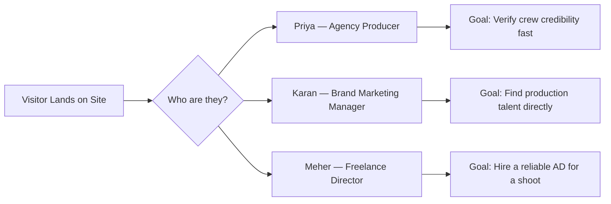
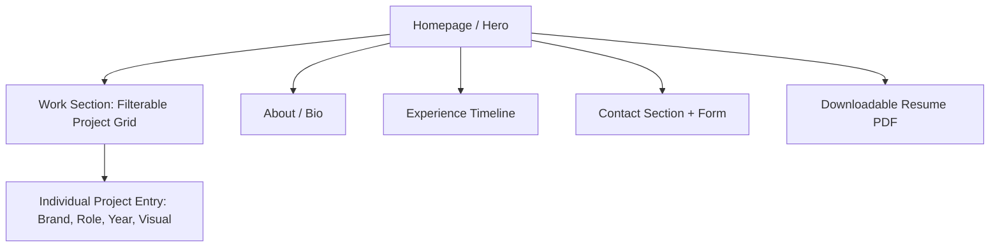
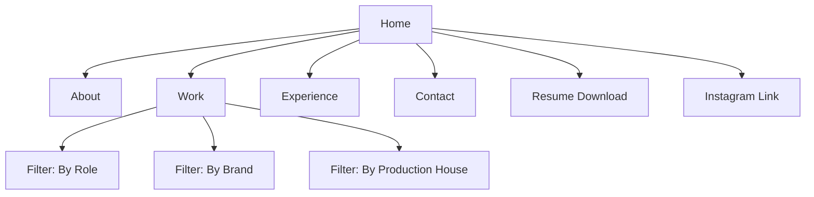

# Product Requirements Document (PRD)
## Donayan Sahdev — Director's Assistant / Creative Producer Portfolio Website

| | |
|---|---|
| **Document Owner** | Chief Product Officer |
| **Product Name** | Donayan Sahdev Portfolio Website |
| **Version** | 1.0 |
| **Status** | Draft — Ready for Build |
| **Date** | July 2026 |

---

## 1. Executive Summary

Donayan Sahdev is a Mumbai-based Director's Assistant, Associate Producer, and Creative Strategist with a five-year track record across in-house production houses (The Glitch/VMLY&R-WPP, Twism Design, Pink Flower) and freelance ad-film sets, working on campaigns for Armani Exchange, Sprite, Tanishq, Dove, Fossil, HDFC, Godrej Capital, and talent including Kareena Kapoor, Kartik Aaryan, Nayanthara, Kajal Agarwal, and Smriti Mandhana.

Today, this body of work is scattered across a PDF resume, a separate PDF "work profile" deck, and an Instagram handle. There is no single, credible, searchable destination that a casting producer, ad agency, or brand marketing team can land on to verify Donayan's credits, see visual proof of the work, and initiate contact.

This PRD defines a **personal portfolio website** that functions as a professional credibility asset and lead-generation tool — positioning Donayan for higher-tier Director's Assistant, Associate Producer, and eventually independent Producer/Director roles.

---

## 2. Vision

To be the definitive, trusted digital front door for Donayan Sahdev's production career — a site that makes hiring, casting, or collaborating with Donayan feel like an obvious, low-risk decision within 60 seconds of landing on the page.

---

## 3. Mission

Build a fast, visually confident, mobile-first portfolio that translates five years of on-set and strategic experience into clear proof of competence — organized by role, brand, and production house — so decision-makers can self-serve credibility checks without a phone call or a PDF download.

---

## 4. Business Goals

| Goal | Description | Success Signal |
|---|---|---|
| G1 — Credibility | Establish a professional, agency-grade online presence | Positive feedback from at least 3 industry contacts within 30 days of launch |
| G2 — Discoverability | Be findable when a producer/agency searches Donayan's name | Ranks on page 1 of Google for "Donayan Sahdev" within 60 days |
| G3 — Lead Generation | Convert visitors into inbound work inquiries | 5+ qualified inbound inquiries per quarter post-launch |
| G4 — Career Positioning | Support transition from Assistant/Producer roles toward senior Producer/Director-track roles | Site referenced in at least 2 job/freelance pitches per month |
| G5 — Low Maintenance | Enable Donayan to update credits without developer help | New project added in under 5 minutes |

---

## 5. Market Opportunity

India's ad-film and branded-content production ecosystem (agencies like VMLY&R, production houses, D2C and legacy brands) increasingly hires Assistant Directors, Associate Producers, and Creative Producers on a **project/freelance basis**, sourced through referrals, Instagram, and personal portfolios rather than formal job boards.

| Trend | Implication for Donayan |
|---|---|
| Rise of D2C and quick-commerce brands commissioning high volumes of ad content | More freelance AD/Producer opportunities outside traditional agencies |
| Production decisions increasingly made by scrolling Instagram/portfolio sites, not resumes | A polished site is now a competitive differentiator, not a nice-to-have |
| Below-the-line production talent (ADs, Producers) rarely have personal branding, unlike directors/DOPs | First-mover advantage — most peers still use PDFs only |
| Brand marketing teams now vet production crews directly for reputation/safety before greenlighting shoots | A credible site reduces friction in the vetting step |

---

## 6. Target Audience

| Segment | Description | What They Want From the Site |
|---|---|---|
| Ad Agency Producers/Creative Directors | Staffing crew for upcoming shoots | Fast proof of relevant brand experience, roles played, availability |
| Production House Owners | Hiring in-house ADs/Producers | Career trajectory, reliability signals, references |
| Brand Marketing Managers | Commissioning content directly (D2C, bypassing agencies) | Case studies, talent-handling experience, contact ease |
| Directors (Freelance) | Looking for a Director's Assistant for a specific shoot | Scheduling/on-set competence, past director collaborations |
| Fellow Industry Professionals | Referral network, potential collaborators | Social proof, network legibility (who Donayan has worked with) |

---

## 7. User Personas

| Persona | Role | Goals | Frustrations Today |
|---|---|---|---|
| **Priya, 32** | Executive Producer at an ad agency | Quickly staff a crew with vetted, brand-safe talent | PDFs get lost in email; no quick way to see brand-fit |
| **Karan, 29** | Brand Marketing Manager, D2C startup | Find production talent without going through an agency markup | Doesn't know where to look beyond Instagram DMs |
| **Meher, 35** | Freelance Ad Film Director | Needs a trusted AD for a 3-day shoot on short notice | Referrals are word-of-mouth only; no way to self-verify a stranger's credits |

---

## 8. Pain Points (Current State)

| Pain Point | Impact |
|---|---|
| Credits are split across a resume PDF and a separate "work profile" PDF | Recruiters won't open two documents; drop-off |
| No visual proof (images/videos) of on-set work, only text lists | Hard to judge quality or production scale |
| Not mobile-friendly (PDFs) | Most recruiters browse on Instagram/phone first |
| No single link to share | Awkward in bios, emails, DMs |
| Talent/brand names not visually credentialed (logos, faces) | Underselling high-profile experience (Kareena Kapoor, Armani Exchange, etc.) |
| No contact CTA | Interested parties don't know the fastest way to reach out |
| Inconsistent role titles across documents (DA, AD, Producer, Project Manager) | Confusing to non-industry readers (e.g., D2C brand teams) |

---

## 9. Competitive Analysis

| Platform | Strength | Weakness (vs. Donayan's Own Site) |
|---|---|---|
| LinkedIn Profile | Searchable, network-based | Text-heavy, not visual, buried among unrelated content |
| Instagram Portfolio | Visual proof, native to industry | No structured credit list, hard to filter by role/brand, algorithm-dependent |
| IMDb (Assistant Director credits) | Industry-standard credibility source | Slow to update, incomplete for ad-film/branded work, no contact path |
| Behance/personal PDF | Downloadable, portable | Static, not shareable as a "living" link, poor on mobile |
| **Donayan's Portfolio Website (Proposed)** | Combines visual proof + structured credits + one shareable link + direct contact CTA | Requires initial build and ongoing content updates |

---

## 10. Functional Requirements

| ID | Requirement | Priority |
|---|---|---|
| FR1 | Homepage with name, role title, one-line positioning statement, and hero visual/reel | Must |
| FR2 | "Work" section listing projects, filterable by role (DA, AD, Producer, Social Strategist) and by production house (Pink Flower, Twism, The Glitch, Freelance) | Must |
| FR3 | Each project entry shows: brand name, talent/director involved, role played, year, and (where available) an image or embedded video | Must |
| FR4 | "About" section summarizing career journey, skills, and objective | Must |
| FR5 | "Experience" timeline (in-house roles chronologically, per resume) | Must |
| FR6 | "Contact" section with email, phone, and a simple inquiry form | Must |
| FR7 | Downloadable resume PDF (kept in sync with site content) | Must |
| FR8 | Social links (Instagram) prominently placed | Must |
| FR9 | Admin-friendly content structure so new projects can be added without touching code (CMS or structured data file) | Should |
| FR10 | Skills section grouped by category (Digital Marketing, Creative & Strategic, Production & On-Set, Technical) | Should |
| FR11 | Testimonials/quotes section from directors or clients (if obtained) | Could |
| FR12 | Basic analytics to track visitor source and inquiry conversions | Should |
| FR13 | SEO metadata (name, role, location) for discoverability | Must |

---

## 11. Non-Functional Requirements

| ID | Requirement |
|---|---|
| NFR1 | Mobile-first responsive design (primary traffic expected on phones) |
| NFR2 | Page load under 3 seconds on 4G |
| NFR3 | Accessible (readable contrast, alt text on images) |
| NFR4 | Secure contact form (spam protection) |
| NFR5 | Cross-browser support (Chrome, Safari, Instagram in-app browser) |
| NFR6 | Content update turnaround under 5 minutes for a new project entry |
| NFR7 | Hosting uptime of 99.9% |
| NFR8 | Visual design must feel premium/agency-grade, not template-generic |

---

## 12. User Stories

| ID | As a... | I want to... | So that... |
|---|---|---|---|
| US1 | Agency Producer | See Donayan's most relevant brand credits at a glance | I can quickly assess fit for my project |
| US2 | Brand Marketing Manager | Filter work by "Producer" role | I can evaluate suitability for a producer-level engagement |
| US3 | Freelance Director | See past director collaborations | I can gauge working-style compatibility |
| US4 | Any visitor | Contact Donayan directly from the site | I don't have to search for an email elsewhere |
| US5 | Donayan | Add a new project after a shoot wraps | My site stays current without developer help |
| US6 | Recruiter on mobile | View the site cleanly on a phone via an Instagram bio link | I don't bounce off a broken/slow page |

---

## 13. Acceptance Criteria (Sample — MVP Critical Stories)

**US1 — View relevant brand credits at a glance**
- Given a visitor lands on the homepage
- When they scroll to the "Work" section
- Then they see project cards with brand logo/name, role, and year, sorted by most recent first

**US4 — Contact Donayan directly**
- Given a visitor wants to reach out
- When they click "Contact" or the CTA button
- Then a form or mailto link opens requiring only name, email, and message, and submission triggers a confirmation state

**US5 — Add a new project**
- Given Donayan completes a new shoot
- When they access the content update method (CMS/structured file)
- Then they can add project name, brand, role, year, and an image within 5 minutes without editing site code

---

## 14. KPIs

| KPI | Target | Measurement Window |
|---|---|---|
| Unique visitors | 300+ | First 90 days |
| Inbound inquiries via contact form | 5+ per quarter | Ongoing |
| Average session duration | 1.5+ minutes | Ongoing |
| Bounce rate | Under 55% | Ongoing |
| Mobile traffic load performance | Under 3s load time | Ongoing |
| Google search ranking for "Donayan Sahdev" | Page 1 | 60 days post-launch |
| Resume PDF downloads | Tracked, directional only | Ongoing |

---

## 15. MVP Scope

**In scope for MVP:**
- Homepage, About, Work (filterable grid), Experience timeline, Contact
- All existing credits from resume + work profile PDFs, normalized into one structured list
- Mobile-responsive design
- Resume PDF download
- Basic SEO setup
- Instagram link integration

**Out of scope for MVP:**
- Video reel embeds beyond simple links/thumbnails
- Testimonials
- Multi-language support
- Blog/journal section
- Advanced analytics dashboards

---

## 16. Phase 2

| Feature | Rationale |
|---|---|
| Embedded video reels per project | Deepens proof of production quality beyond stills |
| Testimonials from directors/clients | Strengthens trust signal for high-stakes hires |
| Case study format for flagship projects (e.g., Armani Exchange, Tanishq) | Demonstrates strategic thinking, not just execution |
| CMS-based project management dashboard | Reduces friction for Donayan to self-serve updates |
| Analytics dashboard (traffic source, inquiry conversion) | Informs where to invest outreach (Instagram vs. LinkedIn vs. referral) |
| Newsletter/update signup for collaborators | Builds a direct audience independent of social platforms |

---

## 17. Risks

| Risk | Likelihood | Impact | Mitigation |
|---|---|---|---|
| Inconsistent/missing visual assets for older projects | High | Medium | Prioritize recent, high-profile projects with available assets for MVP; backfill over time |
| Role titles remain inconsistent across sources, confusing non-industry visitors | Medium | Medium | Normalize titles during content structuring (e.g., standardize "DA" as "Director's Assistant") |
| Site goes stale without regular updates | Medium | High | Ensure FR9 (easy content updates) is delivered in MVP, not deferred |
| Overly generic template design undermines "premium" positioning | Medium | High | Enforce NFR8 with dedicated design pass, not default theme |
| Brand/talent names used without explicit permission raise IP concerns | Low | Medium | Confirm usage is factual credit-listing (standard industry practice) not implying endorsement; avoid using brand logos without rights clearance |

---

## 18. Constraints

| Constraint | Detail |
|---|---|
| Content source of truth | Two PDFs (resume + work profile) with some inconsistent/duplicate entries requiring manual reconciliation |
| Owner-operated updates | Donayan is not a developer; update mechanism must be non-technical |
| Budget | To be defined — influences hosting/CMS choice (static site vs. managed CMS) |
| Timeline | To be defined — influences MVP scope trade-offs |
| Asset availability | Not all listed projects have accompanying images; some may only ever have text credits |

---

## 19. Future Features

- Personal brand "reel" video on homepage
- Press/media mentions section
- Collaborator directory (directors, photographers, agencies) with cross-links
- Booking/availability calendar for freelance engagements
- Downloadable one-pager tailored per persona (agency vs. brand-direct)

---

## Appendix: Site Information Architecture

