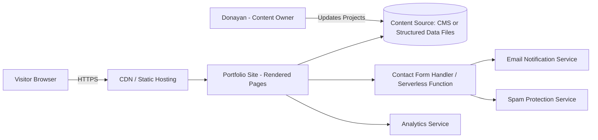
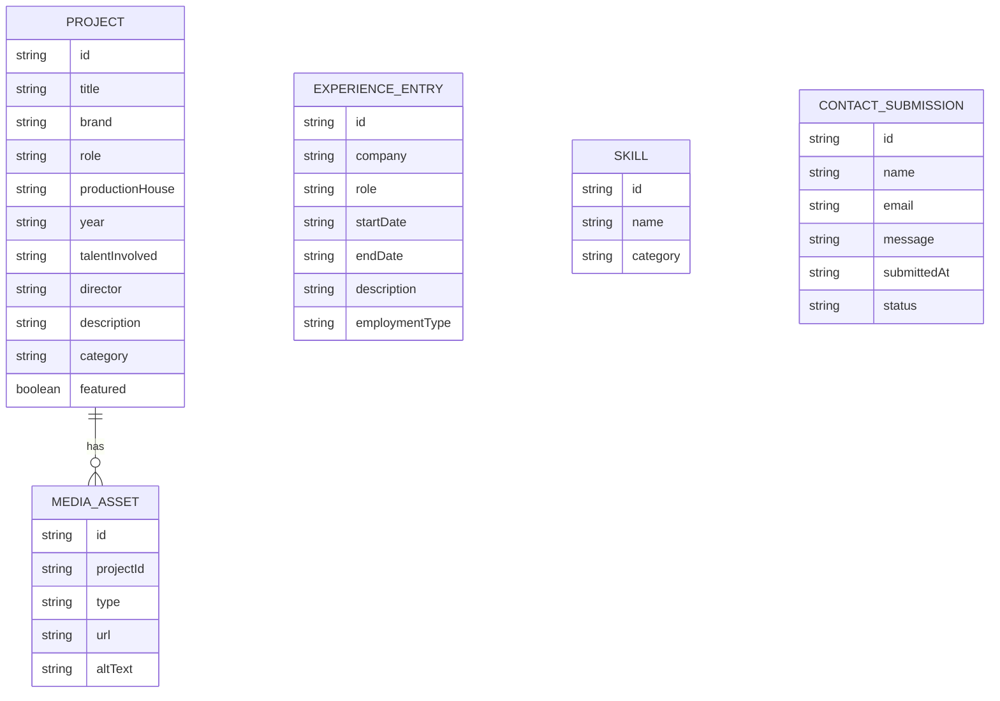
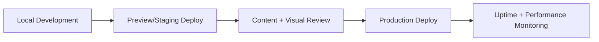
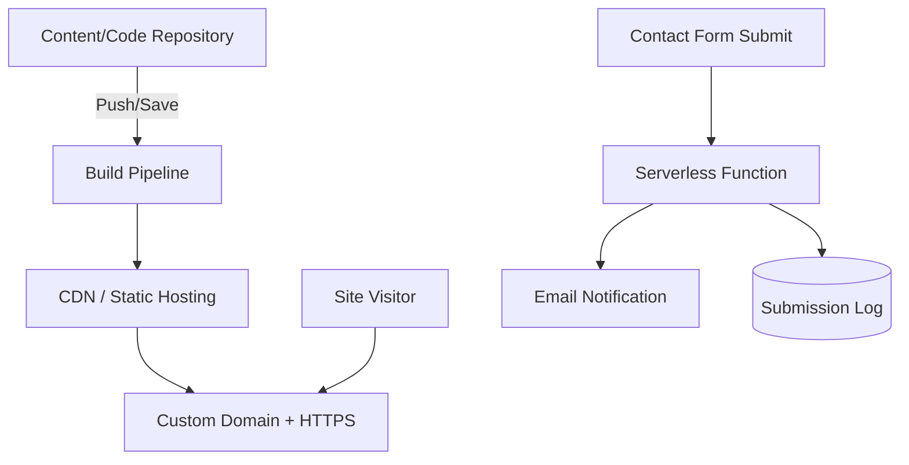

# Technical Requirements Document (TRD)
## Donayan Sahdev — Director's Assistant / Creative Producer Portfolio Website

| | |
|---|---|
| **Document Owner** | Engineering / Technical Lead |
| **Companion Document** | Donayan_Sahdev_Portfolio_Website_PRD.md (v1.0) |
| **Product Name** | Donayan Sahdev Portfolio Website |
| **Version** | 1.0 |
| **Status** | Draft — Ready for Build |
| **Date** | July 2026 |

---

## 1. Purpose & Scope

This TRD translates the approved PRD into concrete technical decisions: architecture, data model, tech stack, hosting, performance/security requirements, and delivery plan. It is written so an engineering team can begin implementation without needing the product context restated. No source code is included here — only structure, contracts, and constraints.

---

## 2. System Overview

The product is a **static/JAMstack-style personal portfolio website** backed by a lightweight, non-technical-friendly content source, deployed to a global CDN, with a simple contact-form integration. There is no user login, no database of user accounts, and no server-side business logic beyond form handling and content retrieval.

---

## 3. Architecture Principles

| Principle | Rationale |
|---|---|
| Static-first | No user accounts, low content volatility — static generation minimizes cost, attack surface, and load time |
| Content/Presentation separation | Donayan updates content without touching layout/design code |
| Mobile-first rendering | Majority of target personas will view via phone/Instagram in-app browser |
| Progressive enhancement | Core content (text, project list) must render even if images/video fail to load |
| Low operational overhead | No dedicated backend team — must run reliably with minimal maintenance |

---

## 4. Tech Stack Recommendation

| Layer | Recommendation | Alternative | Notes |
|---|---|---|---|
| Frontend Framework | Static site generator (e.g., Next.js static export / Astro) | Simple templated HTML/CSS | Enables component reuse for project cards without server dependency |
| Content Source | Headless CMS (e.g., structured content platform) or version-controlled structured data files | Flat JSON/Markdown files in repo | CMS chosen if non-technical editing (FR9) is prioritized over cost |
| Hosting | Global CDN static hosting platform | Any static-capable host | Must support custom domain, HTTPS, and auto-deploy from content updates |
| Contact Form | Serverless function + transactional email service | Third-party form service (embedded) | Must include spam protection (NFR4) |
| Media Storage | CDN-backed image hosting with automatic optimization | Bundled with hosting platform | Required for on-set photos/video thumbnails |
| Analytics | Privacy-respecting lightweight analytics tool | N/A | Tracks visitor source and conversion per KPI section of PRD |
| Domain/DNS | Custom domain (e.g., donayansahdev.com) | Subdomain of hosting provider | Required for credibility (Business Goal G1/G2) |

---

## 5. Data Model

### 5.1 Core Entities

### 5.2 Field-Level Notes

| Entity | Field | Notes |
|---|---|---|
| Project | role | Enum, normalized values only (see Section 6) |
| Project | productionHouse | Enum: Pink Flower, Twism Design, The Glitch, Totality Solutions, Freelance |
| Project | category | Used for Work section filters (FR2): "Director's Assistant," "Producer," "Social Strategy," "Project Management" |
| Project | featured | Boolean flag to control homepage highlight carousel |
| MediaAsset | type | Enum: image, video-embed, video-thumbnail |
| ExperienceEntry | employmentType | Enum: In-House, Freelance, Internship |
| ContactSubmission | status | Enum: new, read, responded — for lightweight inquiry tracking |

---

## 6. Content Normalization Requirements

The current source material (resume PDF + work profile PDF) contains inconsistent role naming and duplicate/overlapping entries. Before content is loaded into the data model, the following normalization must occur:

| Raw Source Value | Normalized Value |
|---|---|
| "DA" | Director's Assistant |
| "AD" (as in "1st AD," "2nd AD," "3rd AD") | Assistant Director (with tier noted separately, e.g., "1st") |
| "Associate Producer" / "Assistant Producer" | Associate Producer |
| "Project Manager" (production context) | Project Manager |
| "Creative Producer" | Creative Producer |
| "Social Media Manager" / "Social Media Strategist" | Social Media Strategist |
| Duplicate entries across resume and work profile (e.g., Armani Exchange appears twice with different seasons) | Treated as distinct project entries by season/year, not merged |

This normalization is a **one-time content migration task**, owned by content, not engineering — but engineering must ensure the data model enforces enums so future entries can't reintroduce inconsistency.

---

## 7. Functional Component Breakdown

| Component | Maps to PRD Requirement | Technical Notes |
|---|---|---|
| Homepage / Hero | FR1 | Static render, includes featured project carousel pulling `featured: true` entries |
| Work Grid + Filters | FR2, FR10 | Client-side filtering by role/brand/productionHouse against pre-fetched project list; no server round-trip needed given small dataset (<100 projects) |
| Project Detail (card or modal) | FR3 | Renders brand, talent, role, year, description, media asset(s) |
| About Section | FR4 | Static content block, sourced from CMS/data file |
| Experience Timeline | FR5 | Rendered chronologically from ExperienceEntry entity, sorted by startDate desc |
| Contact Form | FR6, NFR4 | Serverless function receives submission, validates, applies spam protection, stores in ContactSubmission log, triggers email notification |
| Resume Download | FR7 | Static PDF asset; process required to keep in sync with live content (see Section 11) |
| Social Links | FR8 | Static links in header/footer |
| Content Update Mechanism | FR9 | CMS UI or documented structured-file editing process |
| SEO Metadata | FR13 | Per-page meta title/description; structured data (Person schema) for name/role/location |

---

## 8. Non-Functional Requirements — Technical Detail

| NFR (from PRD) | Technical Implementation Requirement |
|---|---|
| NFR1 — Mobile-first responsive | Breakpoints tested at 360px, 768px, 1024px, 1440px minimum |
| NFR2 — Load under 3s on 4G | Enforce image optimization/lazy-loading; target Lighthouse Performance score 85+ |
| NFR3 — Accessibility | WCAG 2.1 AA target: alt text on all media, contrast ratio 4.5:1 minimum, semantic HTML structure |
| NFR4 — Secure contact form | Server-side validation, honeypot or CAPTCHA, rate limiting on submission endpoint |
| NFR5 — Cross-browser support | Verified on Chrome, Safari, and Instagram/Facebook in-app WebView browsers specifically (primary traffic source) |
| NFR6 — Content update under 5 min | CMS/data-file workflow must not require a redeploy step performed by a developer; auto-publish on save |
| NFR7 — 99.9% uptime | Hosting provider SLA must meet or exceed this; monitored via uptime check tool |
| NFR8 — Premium visual quality | Custom design system (typography, spacing, imagery treatment) — explicitly not a default template theme |

---

## 9. Security & Privacy Requirements

| Requirement | Detail |
|---|---|
| HTTPS enforced site-wide | No mixed content; auto-redirect HTTP to HTTPS |
| Contact form data handling | Submissions stored securely; access limited to Donayan; no third-party data resale |
| No unnecessary PII collection | Contact form limited to name, email, message only |
| Third-party embeds (Instagram, video) | Loaded with privacy-conscious embedding (e.g., deferred/lazy iframe loading) to avoid unnecessary tracking on page load |
| Dependency management | Framework/library dependencies kept current; no use of unmaintained packages |

---

## 10. Analytics & Measurement Mapping

| PRD KPI | Technical Tracking Requirement |
|---|---|
| Unique visitors | Page view tracking via analytics tool |
| Inbound inquiries via contact form | Event tracking on successful form submission |
| Average session duration | Native analytics session tracking |
| Bounce rate | Native analytics tracking |
| Mobile load performance | Automated Lighthouse/Core Web Vitals monitoring, checked pre- and post-deploy |
| Google search ranking | Search Console integration; sitemap.xml and robots.txt configured at launch |
| Resume PDF downloads | Event tracking on download link click |

---

## 11. Content Sync — Resume PDF

Since FR7 requires a downloadable resume PDF that stays consistent with live site content, two approaches are viable:

| Approach | Trade-off |
|---|---|
| A — Auto-generated PDF from live content (e.g., rendered from the Experience/Work data at build time) | Always in sync; higher initial engineering effort |
| B — Manually maintained PDF, updated alongside content changes | Lower engineering effort; risk of drift if not manually kept current |

**Recommendation:** Approach B for MVP (matches PRD MVP scope trade-offs), with Approach A flagged as a Phase 2 technical enhancement.

---

## 12. Environments & Release Process

| Environment | Purpose |
|---|---|
| Local | Development and component testing |
| Preview/Staging | Auto-deployed per content or code change for review before go-live |
| Production | Live, custom domain, monitored |

---

## 13. Testing Strategy

| Test Type | Coverage |
|---|---|
| Responsive/visual QA | All breakpoints (Section 8), Instagram in-app browser specifically |
| Functional QA | Filters (Work grid), contact form submission + validation, resume download |
| Performance QA | Lighthouse score check pre-launch and on major content additions |
| Accessibility QA | Automated scan (e.g., axe) + manual keyboard navigation check |
| Content QA | Verify all normalized project entries against source PDFs for accuracy (no dropped/duplicated credits) |

---

## 14. Technical Risks

| Risk | Likelihood | Impact | Mitigation |
|---|---|---|---|
| Content owner (Donayan) unable to use CMS without support | Medium | Medium | Choose CMS with simple, visual editing UI; provide short walkthrough documentation |
| Image assets not optimized, hurting load time (NFR2) | Medium | Medium | Enforce automatic image optimization pipeline in hosting/CDN layer |
| Instagram in-app browser rendering inconsistencies | Medium | Medium | Explicit QA pass in that environment before launch (Section 13) |
| Resume PDF drifts out of sync with site (Section 11) | Medium | Low-Medium | Add drift check to content-update checklist |
| Spam submissions to contact form | Medium | Low | Rate limiting + honeypot/CAPTCHA per NFR4 |

---

## 15. Technical Constraints

| Constraint | Detail |
|---|---|
| No dedicated engineering team post-launch | Architecture must minimize ongoing maintenance (favors static/serverless over custom backend) |
| Content owner is non-technical | Rules out any update workflow requiring code edits or redeploy commands |
| Budget undefined | Stack recommendations include lower-cost alternatives per layer (Section 4) |
| Small dataset (<100 projects expected) | Justifies client-side filtering over building a search backend/API |

---

## 16. Phase 2 Technical Roadmap

| Item | Technical Note |
|---|---|
| Embedded video reels per project | Requires video hosting/CDN with adaptive streaming; lazy-load to protect NFR2 |
| Testimonials module | New data entity (Testimonial: quote, author, role, projectId reference) |
| Auto-generated resume PDF | Build-time PDF generation from live data (Section 11, Approach A) |
| CMS-based project dashboard | If Phase 1 used flat structured files, migrate to full headless CMS |
| Analytics dashboard | Aggregate reporting layer on top of existing analytics tool, or scheduled export |

---

## Appendix: Deployment Architecture

