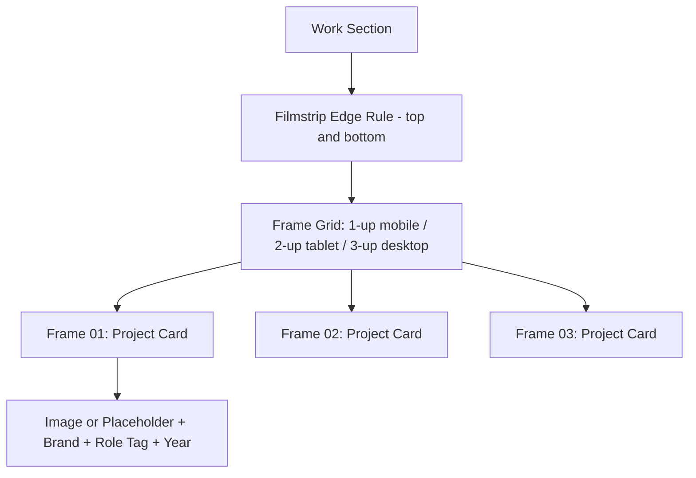

# UI System
## Donayan Sahdev — Director's Assistant / Creative Producer Portfolio Website

| | |
|---|---|
| **Document Owner** | Design Lead |
| **Companion Documents** | PRD (v1.0), TRD (v1.0), Database Design (v1.0) |
| **Version** | 1.0 |
| **Status** | Draft — Ready for Build |
| **Date** | July 2026 |

---

## 1. Design Thesis

Donayan's own work-profile deck already contains the seed of a real identity: a black screen-board background, a cream content card, a deep green tag, and a filmstrip graphic. That is not incidental — it's the vernacular of her actual world: **slates, call sheets, contact sheets, and film reels.**

The UI System formalizes and extends that vernacular rather than replacing it with a generic "creative portfolio" look. The site should feel like it was art-directed by someone who has actually stood on set holding a slate — not templated from a design tool.

**Signature element:** The Work section is laid out as a **contact sheet** — a grid of "frames," each one a project, numbered like negatives on a strip, with a soft sprocket-hole rule running along the section edge. This is not decorative numbering; on a contact sheet, frame numbers are how an editor actually finds and references a shot, which mirrors exactly how a producer scans Donayan's credits.

---

## 2. Design Principles

| Principle | What it means here |
|---|---|
| Set-ready, not stylized | Confident, functional, slightly utilitarian — like production paperwork, not a lifestyle brand |
| One accent, used with intent | Slate green marks action and status, the way a tally light marks "live" — it is never just decoration |
| Type does the talking | A single bold condensed display face carries all personality; everything else stays quiet |
| Content-led imagery | Real on-set photography and brand work is the hero, never stock photography or illustration |
| Fast and legible on a phone | Most visitors open this from an Instagram bio link — design for a thumb, not a mouse |

---

## 3. Color System

| Token | Hex | Usage |
|---|---|---|
| `ink` | #14140F | Primary background (dark sections, header, footer) |
| `reel-cream` | #F2EEE3 | Primary background (light sections, cards) |
| `paper` | #FBFAF6 | Card surfaces on light sections, subtle lift off `reel-cream` |
| `slate-green` | #1F3D2E | Primary accent — CTAs, active filters, tags, links |
| `clapper-red` | #B23A2E | Sparing use only — "featured" markers, status dots, hover accents. Never for large fills |
| `warm-grey` | #8C8577 | Secondary text, metadata, captions, dividers |

**Usage discipline:**
- `ink` and `reel-cream` alternate by section to create visual rhythm down the page (like alternating scenes) — never mix both as background within a single section.
- `clapper-red` appears in small doses only: a single dot, a thin rule, a tag border. If more than ~5% of a viewport is red, pull it back.
- Text on `ink` is `reel-cream`; text on `reel-cream`/`paper` is `ink`. No grey-on-grey body text.

| Contrast Pair | Ratio | Passes WCAG AA |
|---|---|---|
| `reel-cream` text on `ink` background | 15.1:1 | Yes |
| `ink` text on `reel-cream` background | 15.1:1 | Yes |
| `warm-grey` text on `paper` background | 4.6:1 | Yes (body text minimum) |
| `slate-green` on `reel-cream` | 8.9:1 | Yes |

---

## 4. Typography System

| Role | Typeface Direction | Notes |
|---|---|---|
| Display | Bold, condensed grotesk (heavyweight, tight tracking) | Used for name lockup, section headers, hero statements — mirrors the oversized black lettering already established in the work profile deck |
| Body | Clean humanist sans, regular/medium weights only | Carries bios, descriptions, form labels — must stay legible at small mobile sizes |
| Utility / Metadata | Monospace or semi-mono | Reserved for role tags, years, brand names, timecodes-style labels (e.g., "DA · 2026," "SS'25") — evokes call sheet/slate lettering |

### 4.1 Type Scale

| Token | Size (desktop) | Size (mobile) | Weight | Used for |
|---|---|---|---|---|
| Display / XL | 96px | 48px | Bold, condensed | Homepage name lockup |
| Display / L | 56px | 32px | Bold, condensed | Section headers ("WORK," "ABOUT") |
| Display / M | 32px | 24px | Bold, condensed | Project titles, card headers |
| Body / L | 20px | 18px | Regular | Intro/bio paragraph, hero subhead |
| Body / M | 16px | 16px | Regular | Standard body copy, form fields |
| Body / S | 14px | 14px | Regular | Descriptions inside project cards |
| Utility | 13px | 12px | Medium, uppercase, tracked +4% | Role/brand/year tags, timeline dates, nav labels |

**Rule:** Display type is always set in uppercase or title case with tight letter-spacing; body type is always sentence case. Never mix the two conventions.

---

## 5. Layout & Grid

| Breakpoint | Column Grid | Outer Margin | Notes |
|---|---|---|---|
| Mobile (< 768px) | 4 columns | 20px | Single-column stacking for all content blocks |
| Tablet (768–1023px) | 8 columns | 32px | Work grid becomes 2-up |
| Desktop (1024px+) | 12 columns | 64px | Work grid becomes 3-up ("contact sheet" strip) |

**Spacing scale (base unit 4px):**

| Token | Value | Typical use |
|---|---|---|
| space-1 | 4px | Tag internal padding |
| space-2 | 8px | Icon-to-label gaps |
| space-3 | 16px | Card internal padding (mobile) |
| space-4 | 24px | Card internal padding (desktop) |
| space-5 | 40px | Gap between related elements (e.g., project cards) |
| space-6 | 64px | Gap between sub-sections |
| space-7 | 96px+ | Gap between major page sections |

---

## 6. Signature Motif: The Contact Sheet

| Element | Specification |
|---|---|
| Frame numbering | Each project card is labeled `01`, `02`, `03`... in utility type, top-left corner — mirrors contact-sheet frame numbers |
| Sprocket rule | A thin dashed/dotted rule runs along the top and bottom of the Work section, referencing filmstrip perforations — implemented as a subtle border treatment, not literal icons |
| Frame without image | If a project has no media asset yet (per Database Design Section 3.2), the frame renders as an `ink`-background card with the utility-type project details centered — reads as an intentional "unexposed frame," not a broken image state |
| Featured frame | Featured projects (Database `featured: true`) get a `clapper-red` corner dot — echoing a tally light, not a badge/ribbon |

---

## 7. Core Components

| Component | Behavior / Notes |
|---|---|
| **Header / Nav** | Fixed, minimal: name lockup (small) + 4 links (Work, About, Experience, Contact) + Instagram icon. Collapses to a single menu icon under 768px |
| **Hero** | Full-bleed `ink` background, oversized name in Display/XL, one-line role/positioning statement in Body/L, single primary CTA ("See the Work") in `slate-green` |
| **Project Card (Frame)** | Image or placeholder (4:5 portrait ratio, matching on-set photo orientation) → frame number → brand name (Display/M) → role + year tag (Utility) → optional one-line description on hover/tap |
| **Filter Bar** | Horizontal scrollable chip row on mobile, inline row on desktop. Active filter uses `slate-green` fill; inactive filters are outlined only |
| **Experience Timeline** | Vertical rule (not literal, just a thin `warm-grey` line) with each entry as a horizontal row: dates (Utility) — role/company (Display/M) — description (Body/S) |
| **Skills Block** | Four labeled clusters (Digital Marketing, Creative & Strategic, Production & On-Set, Technical) rendered as tag groups, not bullet lists — keeps the page feeling like credential tags rather than a resume dump |
| **Contact Form** | Three fields only (name, email, message) per Database Design Section 3.7 — single-column, generous spacing, `slate-green` submit button, confirmation state replaces the form on success rather than a popup |
| **Footer** | `ink` background, name lockup (small), Instagram + email, resume download link, copyright line |

---

## 8. Imagery Guidelines

| Rule | Rationale |
|---|---|
| Only real production photography/stills — no stock imagery, no illustration | Preserves credibility; this is a credentialing tool, not a mood board |
| Consistent crop ratio (4:5 portrait) across all project frames | Keeps the "contact sheet" grid visually uniform even with mismatched source photos |
| Desaturate hover states slightly rather than adding color overlays | Keeps focus on the work itself, avoids a "filtered" Instagram feel that would undercut the professional tone |
| Talent/brand names always paired with role tag, never floating alone on an image | Prevents any implication of endorsement beyond factual crediting (ties to PRD Risk on IP/brand usage) |

---

## 9. Motion Principles

| Moment | Treatment |
|---|---|
| Page load | Single orchestrated reveal: name lockup fades/settles in, then hero CTA — no more than one load animation |
| Work grid entry | Frames fade up slightly on scroll into view, staggered by ~60ms per frame — evokes a contact sheet being laid out, not a generic fade-in library effect |
| Card hover (desktop) | Subtle 1.02 scale + description reveal — no rotation, no shadow pop |
| Filter change | Non-matching frames fade out in place rather than the grid reflowing abruptly |
| Reduced motion | All of the above must degrade to instant state changes when `prefers-reduced-motion` is set — this is a hard requirement, not optional polish |

---

## 10. Accessibility Requirements (UI-Specific)

| Requirement | Detail |
|---|---|
| Visible keyboard focus | All interactive elements (nav links, filter chips, form fields, CTA) require a visible focus ring in `slate-green`, not the browser default only |
| Alt text | Every project frame image requires descriptive alt text pulled from `MediaAsset.altText` (Database Design Section 3.2) — never left blank |
| Tap targets | Minimum 44x44px for all buttons/chips on mobile |
| Color independence | Featured-project indicator (red dot) must be paired with the word "Featured" in utility type for anyone who can't perceive the color distinction |
| Form errors | Inline, in plain language, next to the relevant field — not color alone, include a text label |

---

## 11. Voice Inside the UI

| Element | Voice Direction |
|---|---|
| CTA labels | Plain and active: "See the Work," "Send a Message," "Download Resume" — never "Submit" or "Learn More" |
| Empty/missing states | Direct, in the site's own voice: e.g., a frame with no image yet reads "Frame not yet developed" rather than a broken-image icon — playful but on-theme, never apologetic |
| Form confirmation | "Message sent — Donayan will get back to you shortly." Names the actual next step, not a generic "Thank you!" |
| Filter labels | Use the normalized role vocabulary from the Database Design document exactly (e.g., "Director's Assistant," not "DA") so first-time visitors outside the industry aren't lost |

---

## 12. Do / Don't

| Do | Don't |
|---|---|
| Let real production photography carry visual weight | Add stock photography or generic creative-industry illustration |
| Use `clapper-red` in small, intentional doses | Use it as a large background or button fill color |
| Keep the contact-sheet frame numbering functional (it aids scanning) | Add numbering to sections where order carries no real meaning (e.g., don't number the Skills tags) |
| Let sections alternate `ink`/`reel-cream` cleanly | Mix both backgrounds within a single section |
| Keep animation to one orchestrated load moment plus restrained scroll reveals | Add hover effects, parallax, or transitions on every element — reads as templated, not intentional |

---

## 13. Open Design Decisions

| Decision | Owner | Notes |
|---|---|---|
| Final display/body/utility typeface selection (specific font families/licensing) | Design Lead | Direction specified above (Section 4); exact typefaces to be selected and licensed before build |
| Whether Instagram grid embeds are used anywhere beyond a footer link | Design Lead + Donayan | Would reinforce the visual-proof goal but adds a third-party dependency (see TRD Section 9) |
| Placeholder treatment final art for "frame not yet developed" state | Design Lead | Direction specified above (Section 6); needs final visual execution |
