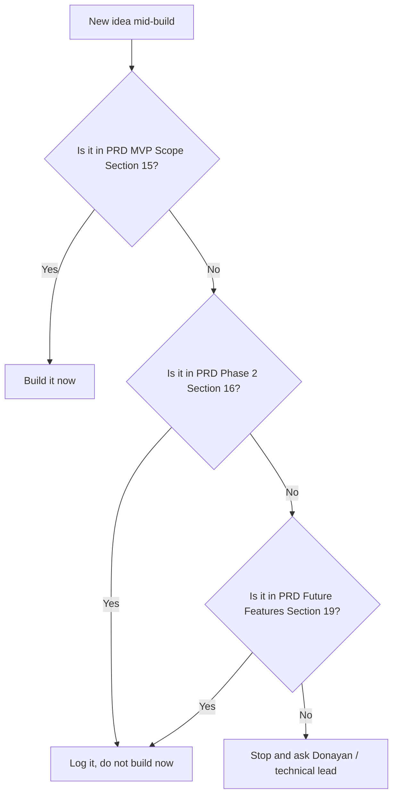

# Vibe Coding Rules
## Donayan Sahdev — Director's Assistant / Creative Producer Portfolio Website

| | |
|---|---|
| **Document Owner** | Technical Lead |
| **Companion Documents** | PRD (v1.0), TRD (v1.0), Database Design (v1.0), UI System (v1.0) |
| **Audience** | Anyone (human or AI coding assistant) building this site |
| **Version** | 1.0 |
| **Status** | Draft — Ready for Build |
| **Date** | July 2026 |

---

## 1. Purpose

This document is the guardrail layer for building the site with an AI pair-programmer (Claude Code, Cursor, or similar). The four companion documents already made the hard decisions — architecture, data model, visual system, scope. **Vibe coding drifts when those decisions get silently re-decided mid-build.** This document exists to stop that drift.

Treat this as the rules the coding assistant should be pointed to (e.g., pasted into a `CLAUDE.md` / project-rules file) at the start of every build session.

---

## 2. Non-Negotiables

These override any in-the-moment suggestion, including the AI assistant's own default instincts, unless Donayan or the technical lead explicitly approves a change.

| Rule | Why |
|---|---|
| Do not introduce a new color outside the 6 tokens in UI System Section 3 | Prevents palette drift, the #1 way "vibe coded" sites end up inconsistent |
| Do not introduce a new typeface beyond the 3 roles in UI System Section 4 | Same reason — type is the personality of this site; more fonts dilutes it |
| Do not add a page, section, or feature not listed in PRD Section 15 (MVP Scope) | Scope creep is how "quick portfolio sites" become 6-month builds |
| Do not fabricate project details, brand names, talent names, or dates | This is a credibility tool — a single invented or wrong credit undermines the entire premise (see Section 6) |
| Do not skip the data-quality flags in Database Design Section 7 | Those items (spelling, possible duplicates, date overlaps) must be resolved with Donayan before content goes live, not guessed at |
| Do not change the tech stack direction (TRD Section 4) without updating the TRD | Keeps documentation and implementation from silently diverging |

---

## 3. Design System Lock-In

| Instruction to the AI assistant | Guardrail |
|---|---|
| "Build the hero section" | Must use `ink` background, Display/XL name lockup, Body/L subhead, single `slate-green` CTA — per UI System Section 7 |
| "Add a new component" | Check UI System Section 7 first. If it's not listed, stop and ask whether it belongs, rather than inventing a plausible-looking one |
| "Make it pop more" / "add some flair" | Translate this into the system's existing vocabulary (motion per Section 9, `clapper-red` in small doses) — do not reach for a new gradient, shadow style, or animation library to satisfy a vague request |
| Any hover/animation addition | Must map to UI System Section 9 (Motion Principles). If it's not an orchestrated load moment, a scroll reveal, or a restrained hover state, it's out |
| Accessibility asks ("make it accessible") | Not a one-time pass — every component build must satisfy UI System Section 10 before being marked done |

---

## 4. Data Model Lock-In

| Instruction to the AI assistant | Guardrail |
|---|---|
| "Add the project data" | Must conform exactly to the schema in Database Design Section 3 — field names, enums, relationships. Do not add convenience fields on the fly (e.g., a flat `talentInvolved` string) that bypass the `ProjectTalent` join table |
| "This project doesn't have a photo yet" | Render the "Frame not yet developed" empty state (UI System Section 6) — do not substitute a stock/placeholder image |
| Normalizing a role title | Must match the enum list in Database Design Section 5.1 exactly. If a source credit doesn't cleanly map, stop and ask rather than inventing a new enum value |
| Talent/brand name spelling conflicts | Must be resolved against Database Design Section 7's flagged issues before being committed as content — do not silently pick one spelling |

---

## 5. Scope Discipline

| Situation | Correct Response |
|---|---|
| Mid-build idea feels small and easy to add ("while I'm in here, let me also add a testimonials carousel") | Still out of scope if not in PRD MVP Section 15 — log it against Phase 2 instead of building it |
| AI assistant suggests a "quick win" feature unprompted | Evaluate against the flowchart above before accepting, even if the suggestion is good |
| A Phase 2 item turns out to be trivial to build alongside an MVP item | Still don't build it now — bundling now creates untracked scope and untested surface area at launch |

---

## 6. Content Accuracy Rules

| Rule | Enforcement |
|---|---|
| Every project entry must trace back to a specific line in the resume PDF or work profile PDF | No "reasonable-sounding" project should be invented to fill a gap in the grid |
| Brand names, talent names, and role titles are facts, not copy to be "improved" | The AI assistant should not paraphrase or embellish a credit (e.g., do not turn "DA – Vicks Bumper Ads '22" into an invented sentence about creative direction unless Donayan confirms that framing) |
| Descriptions/blurbs written to fill out a project card must be flagged as drafted, not sourced | Mark any AI-written project description clearly for Donayan's review before publish — don't treat generated copy as final |
| Dates and employment ranges must match the source documents exactly | Any apparent inconsistency (see Database Design Section 7) gets resolved with Donayan, never "fixed" by guessing which source is right |

---

## 7. Technical Guardrails

| Rule | Reference |
|---|---|
| Stay within the static-first, no-custom-backend architecture | TRD Section 3 |
| Contact form must include spam protection before launch, not after | TRD Section 8 (NFR4) |
| Every image needs alt text before it ships | UI System Section 10 / Database Design Section 3.2 |
| Test in the Instagram in-app browser specifically, not just Chrome/Safari | TRD Section 13 |
| Performance budget: Lighthouse Performance score 85+ | TRD Section 8 (NFR2) |
| Reduced-motion support is required, not optional polish | UI System Section 9 |

---

## 8. Recommended Build Sequence

Building section-by-section, with a review checkpoint after each, keeps a vibe-coded build from sprawling.

| Order | Build | Review Checkpoint Before Moving On |
|---|---|---|
| 1 | Design tokens (colors, type scale, spacing) as reusable foundations | Matches UI System Sections 3–5 exactly — no ad-hoc values |
| 2 | Header/Nav + Footer | Matches UI System Section 7; responsive at all breakpoints in Section 5 |
| 3 | Hero | Matches UI System Section 7; one load animation only |
| 4 | Work Grid + Project Card ("contact sheet") + Filters | Matches UI System Sections 6–7; data pulled from schema, not hardcoded |
| 5 | About + Experience Timeline | Matches UI System Section 7; dates sourced correctly per Section 6 (Content Accuracy) |
| 6 | Contact Form | Spam protection in place; confirmation state matches UI System Section 11 (Voice) |
| 7 | Resume download + Social links | Resume PDF matches live content per TRD Section 11 |
| 8 | Full responsive + accessibility + performance pass | Full checklist in Section 9 below |

---

## 9. Pre-Launch Checklist

| Check | Source |
|---|---|
| All colors trace to the 6 approved tokens | UI System Section 3 |
| All type usage traces to the 3 approved type roles | UI System Section 4 |
| All content traces to source PDFs, with flagged issues resolved | Database Design Section 7 |
| No Phase 2/Future Features items were built into MVP | PRD Sections 16, 19 |
| Contact form tested for spam resistance and validation | TRD Section 8 |
| Site tested on Instagram in-app browser | TRD Section 13 |
| Accessibility pass complete (contrast, alt text, focus states, reduced motion) | UI System Section 10 |
| Lighthouse Performance score 85+ confirmed | TRD Section 8 |
| Resume PDF content matches live site content | TRD Section 11 |
| SEO metadata and sitemap in place | TRD Section 10 |

---

## 10. When to Stop and Ask (Not Guess)

An AI coding assistant should pause and escalate to Donayan or the technical lead — rather than making a plausible-sounding choice — whenever:

- A source document is ambiguous or contradictory (spelling, dates, duplicate-looking entries)
- A requested change would add a new color, font, page, or feature outside the locked system
- A project has no available media asset and the "right" placeholder treatment isn't obvious
- Brand or talent usage raises any question about permission or accuracy
- A "nice to have" idea comes up mid-build that isn't already logged in Phase 2 or Future Features

**Default posture: match the system that's already been decided, don't improve on it unprompted.** Every one of the four companion documents exists so the build doesn't have to re-litigate these calls one component at a time.
